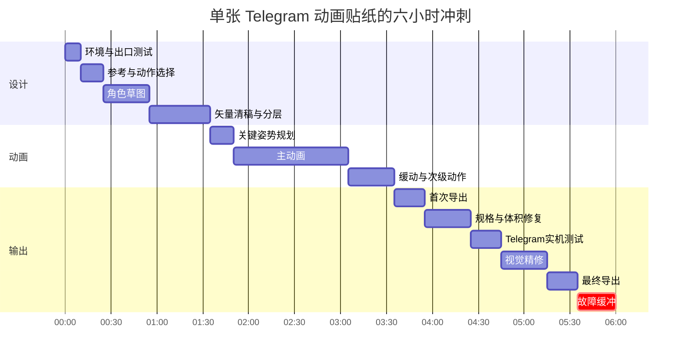

# 六小时内复现 Telegram 贴纸／Emoji 动画视觉风格：可行性研究

## 结论摘要

**结论：可以。** 如果目标是制作 **一张原创、具有明显“Telegram 原生贴纸感”的简单动画贴纸**，而不是逐像素复制某个现有贴纸角色或在六小时内完成整套贴纸，我判断 **六小时内可完成，综合置信度约 88%**。对于已有静态素材再动画化，成功率更高；对于从零创作 `.tgs`，则明显依赖你对矢量图层和关键帧的熟悉程度。

Telegram 本身并不存在一个严格统一的“官方画风”。平台明确允许任何艺术家使用自己的工具创建贴纸，Telegram 早期官方示例包也分别采用火鸡、豚鼠、拟人食物等不同角色体系。因此，真正可以复现的是一组**平台原生视觉规律**：小尺寸下立即可读的轮廓、简化形体、高对比色块、夸张表情、以聊天反应为中心的动作，以及非常短而明确的循环动画。citeturn20view2turn23view0

| 目标 | 六小时判断 | 我的置信度 |
|---|---:|---:|
| 已有原创静态 PNG/WebP → 简单 WebM 动画 | **是，很稳妥** | **95%** |
| 已有干净矢量素材 → `.tgs` | **是** | **90%** |
| 从零设计角色 → 一张简单 `.tgs` | **是** | **80–85%** |
| 完全零动画经验，从零学 AE + 插件 + 设计 + `.tgs` | **勉强可行** | **约 65–70%** |
| 六小时达到成熟商业贴纸包的整套一致性 | **否** | **>95%** |
| 精确复制现有 Telegram 角色、姿势、构图 | 技术上能做，但**不建议，版权风险高** | — |

你的**技能水平和现有软件均未指定**，所以下面的时间预算按“能够学习基本图层、贝塞尔路径和关键帧，但不假定你是专业动画师”来计算。

最关键的技术决策其实不是“用什么画”，而是先选格式：

**已有栅格图、时间极紧 → 优先 WebM。  
从零做简洁矢量、想得到真正的 Telegram Lottie 动画 → 优先 TGS。**

原因很直接：Telegram 的 `.tgs` 规范明确禁止在其推荐的 After Effects 工作流中使用 **Images**，因此不能把一张 PNG 简单丢进去动画后就当成合规 TGS；栅格素材必须先重绘／矢量化。相比之下，WebM 可以直接承载高细节视频动画，而且官方就是为了降低这种制作门槛而提供的视频贴纸路径。citeturn22view0turn22view1

## 视觉语言与技术规格

Telegram 官方示例包包括 **Office Turkey、Melie the Cavy / Rambunctious Rodents、The Foods / Sentient Snacks** 等；官方 2019 年发布动画贴纸时直接把这些列为 starter/sample sets。citeturn23view0 Office Turkey 的创作者也说明，该角色来自 Telegram 动画比赛，并被 Telegram 邀请制作完整默认贴纸包。citeturn20view3

从这些官方／官方关联样例来看，可把“Telegram-native”视觉特征拆成下面几层。这里的“视觉规律”是对代表性样例的分析，不是 Telegram 强制设计规范。

| 维度 | 代表性特征 | 六小时复刻时的建议 |
|---|---|---|
| **线条 / 轮廓** | 强调清楚的外轮廓和形块，而不是复杂线稿；有的包有明显深色描边，有的主要靠色块边界区分。Telegram 对静态贴纸还明确建议“透明背景 + 白色描边 + 黑色阴影”，用于从聊天背景中跳出来。citeturn22view0 | 不必机械使用黑色粗线；优先保证缩小后角色仍一眼可辨。 |
| **色彩** | 偏向少量、明确、饱和度较高的色块，而非写实纹理。The Foods 展示的公开设计包含一组仅七种核心色的调色板，例如 `#EB2A49`、`#EAD205`、`#51A90F`、`#261A09` 等。citeturn20view4 | 控制在约 4–8 个主色最省时间，也最利于控制 TGS 文件大小和风格一致性。 |
| **比例** | 角色主体通常很大、形体紧凑，常见“大头／大身体 + 短肢体 + 简化五官”；Office Turkey、Melie、The Foods 都更重视角色剪影而非解剖真实性。citeturn20view3turn23view2turn23view3 | 让主体占据大部分有效画面，但四周保留足够透明空间，避免动作冲出画布。 |
| **表情** | 眼睛、嘴、眉毛承担大量信息，细节少、情绪跨度大。 | 先做到“缩成聊天尺寸仍能辨认情绪”，再加细节。 |
| **典型姿势** | 与聊天 Emoji 高度对应：笑、吻、点赞、惊讶、挥手、拒绝、鼓掌、生气、哭泣、睡觉、秀肌肉等。Melie 的 21 张预览几乎就是这种 reaction vocabulary。citeturn20view5 Telegram 本身也会根据输入 Emoji 推荐相匹配的贴纸。citeturn23view0 | 第一张作品优先做“挥手／点赞／大笑／惊讶”，动作含义最容易成立。 |
| **动画语言** | 动画非常短，并强调一次明确动作，而不是完整叙事。TGS 强制循环、最长三秒且 60 FPS。citeturn22view0 | 最适合 1.5–2.5 秒：预备动作 → 主动作 → overshoot → 回到起点。 |
| **细节密度** | TGS 的格式限制天然鼓励简单矢量路径、变换和补间动画；Telegram 还禁止多项复杂 AE 功能。citeturn22view0 | 少图层、少节点、少特效通常反而更“像原生 Telegram”。 |

**建议复制的是这些设计原则，而不是某个具体角色。**

### 文件与动画规格

Telegram 当前官方规范非常明确。`.tgs` 是一种基于 Lottie 的特殊 Telegram 格式，在 API 层面是 **gzip 压缩的 Bodymovin JSON**；WebM 路线则使用 VP9。citeturn18view1

| 格式 | 用途 | 分辨率 | 时长 / FPS | 大小限制 | 透明 | 关键要求 |
|---|---|---|---|---:|---|---|
| `.webp` / `.png` | 静态 sticker | 一边必须 **512 px**，另一边 ≤512 | — | Telegram 当前创作页**未单独列静态文件大小上限** | 支持 | 上传可用 PNG/WebP；API 中静态贴纸表现为 WebP。citeturn22view0turn18view1 |
| `.webp` / `.png` | 静态 custom emoji | **100×100** | — | 当前创作页未单列 | 支持 | PNG 或 WebP。citeturn22view0 |
| `.tgs` | Lottie 矢量动画 sticker / emoji | **512×512 画布** | ≤3 秒，**必须 60 FPS**，必须循环 | **≤64 KB** | 通常使用无背景矢量画布 | 不可让对象越界；官方 AE 工作流禁止 Images、Masks、Text、3D Layers、Expressions、Merge Paths、Repeaters、Time Remap 等。citeturn22view0 |
| `.webm` | 视频 sticker | 一边 **512 px**，另一边 ≤512 | ≤3 秒，**≤30 FPS** | **≤256 KB** | 支持 | VP9、无音轨、建议循环。citeturn18view1turn22view1 |
| `.webm` | 视频 custom emoji | **100×100** | ≤3 秒，≤30 FPS | ≤256 KB | 支持 | VP9、无音轨、建议循环。citeturn22view0 |

一个容易混淆的地方是：Telegram 早期宣传中说典型 TGS 只有约 **20–30 KB**，但这不是当前硬性上限；当前制作规范给出的硬上限是 **64 KB**。citeturn20view2turn22view0

对于 WebM，Telegram 官方特别推荐可用 **FFmpeg 或 HandBrake** 进行 VP9 编码，并建议检查 VP9、去除音轨、采用恒定 30 FPS；官方还特别提到，如果渲染失败，可以改用 PNG sequence 作为中间格式。citeturn22view1

## 六小时可执行工作流

总体选择逻辑可以压缩成下面这张图：

```mermaid
flowchart LR
    A[开始] --> B{已有静态角色?}
    B -->|有，PNG/WebP| C[优先 WebM]
    B -->|有，SVG/AI 矢量| D[优先 TGS]
    B -->|没有| E[快速建立原创矢量角色]

    C --> C1[拆成 3-6 个部件]
    C1 --> C2[关键帧/逐帧动画]
    C2 --> C3[VP9 WebM]
    C3 --> C4[≤3秒 ≤30fps ≤256KB]

    E --> D
    D --> D1[5-12个简单矢量图层]
    D1 --> D2[位置/旋转/缩放/路径关键帧]
    D2 --> D3[导出 TGS]
    D3 --> D4[512×512 60fps ≤3秒 ≤64KB]

    C4 --> F[@Stickers 实机测试]
    D4 --> F
```

Telegram 允许使用自己喜欢的编辑软件制作，最终通过 `@Stickers` 创建和管理 sticker / emoji packs。citeturn22view0

**静态贴纸 → 动画变体：最快路线**

这是六小时成功率最高的路径，尤其是原图为 PNG/WebP 时。

| 步骤 | 操作 | 工具选择 | 时间 | 最低技能要求 |
|---|---|---|---:|---|
| 素材检查 | 确认角色原创、透明背景、轮廓干净 | Photoshop / Krita / Photopea / 手机修图 | 10–15 分 | 基础图层 |
| 拆件 | 分出身体、头、眼睛、嘴、手臂等 3–6 个部件 | Krita / Photoshop / Alight Motion | 20–40 分 | 选择、蒙版 |
| 动作设计 | 只设计一个 reaction：挥手、点头、弹跳或惊讶 | 草图即可 | 10–15 分 | 无 |
| 第一遍动画 | 做 1.5–2.5 秒循环；移动、旋转、缩放即可 | Alight Motion / AE / Krita | 40–70 分 | 基本关键帧 |
| 第二遍 | 加 blink、squash/stretch、轻微 overshoot | 同上 | 20–30 分 | easing |
| 导出 | 透明序列／视频 → VP9 WebM | FFmpeg / HandBrake | 15–30 分 | 基础导出 |
| 压缩与测试 | ≤256 KB，≤30 FPS，无音轨，Telegram 实机测试 | @Stickers | 15–25 分 | 无 |

**总耗时：约 2–3.5 小时。**

Krita 明确支持逐帧栅格动画，而 Alight Motion 支持矢量／位图、多层关键帧、缓动以及 PNG sequence、MP4、GIF 等输出，因此两者都适合把现有静态素材快速“动起来”。citeturn20view10turn20view11

**最低可交付成品 MVD：** 一张透明背景、约 2 秒、30 FPS 以内、只含“身体弹一下 + 眨眼 + 手挥一次”的无缝循环 WebM，能被 `@Stickers` 正常接受。

如果**必须**从现有静态 PNG 得到 `.tgs`，要额外加入“矢量化／重绘”步骤。Telegram 的 TGS 规范明确禁止 Images，因此直接嵌入 PNG 并不是合规捷径。citeturn22view0 Glaxnimate 可以把导入的 raster image 通过 Trace Bitmap 转为 vector data，并且可以直接打开、保存和验证 TGS，是相对省事的免费路径。citeturn20view6 这会把整个流程拉长到约 **3–4.5 小时**。

**从零创建原创动画贴纸：最快 TGS 路线**

截至 2026 年 8 月，LottieFiles Creator 的官方文档已经把 `.tgs` 列为直接输出格式，且同时具有 shape、pen、path editing、layers、keyframes、easing，以及 Prompt to Vector 等 AI 辅助工具，因此比“先学习 AE 再配置 Telegram 插件”更适合六小时冲刺。其 TGS 导出文档最近一次更新为 **2026-08-25**。citeturn22view2

| 步骤 | 时间 | 实际动作 |
|---|---:|---|
| 参考分析 | 10–15 分 | 选 2–3 个 Telegram 官方样例，只记录“形块、配色、动作节奏”，不描摹角色 |
| 原创角色草图 | 20–30 分 | 一个主体、夸张头身比例、1 个核心表情 |
| 矢量整理 | 25–40 分 | 控制约 5–12 个可动图层；眼睛、嘴、手臂单独 |
| 动作规划 | 10–15 分 | 起点 → anticipation → 主动作 → overshoot → 回位 |
| 主动画 | 60–90 分 | 只用 position / rotation / scale / opacity / 简单 path 变化 |
| 循环润色 | 20–30 分 | 调 easing、避免首尾跳变 |
| TGS 导出 | 10–20 分 | 60 FPS、≤3 秒、≤64 KB |
| Telegram 测试 | 15–20 分 | `@Stickers` 导入，手机聊天窗口实测 |
| 修复 | 20–40 分 | 简化节点／层数、改节奏、重新导出 |

**总耗时：约 3–5 小时，剩余时间可以作为故障缓冲。**

免费桌面替代方案是 **Glaxnimate**：它是开源的 Windows/macOS/Linux 矢量动画工具，支持 tweening；文档明确支持直接打开、保存 `.tgs`，并在保存时校验 Telegram 格式限制。citeturn20view6turn20view7

如果你已经熟悉 After Effects，则 AE 仍是 Telegram 官方列出的 TGS 工作流，配合 Bodymovin-TG 导出。citeturn20view0turn20view8 但我不会把它推荐给“从零开始、只有六小时”的用户：Telegram 的 Bodymovin-TG GitHub 当前显示的 latest release 是 v5.5.2.3，页面只明确提到加入 **After Effects 2021+** 支持，因此对 2026 年最新 AE 版本，应在项目开始后的前十分钟就做一次最小导出测试，而不能把插件兼容问题留到第五小时。这是基于仓库更新时间作出的风险判断。citeturn20view9

## 工具比较

| 工具名称 | 类型 | 成本 | 学习曲线 | Lottie / `.tgs` | 逐帧 | 主要导出 | 六小时快速复刻推荐 |
|---|---|---|---|---|---|---|---|
| **LottieFiles Creator** | Web | 有免费层 / 付费计划 | 低–中 | **原生 TGS：是** | 非传统逐帧，主打关键帧 | TGS、Lottie JSON、`.lottie`、WebM、MOV、MP4、GIF 等。citeturn22view2 | **★★★★★ 从零做 TGS 首选** |
| **Glaxnimate** | Windows/macOS/Linux 桌面 | **免费开源** | 中 | **是，直接读写并校验 TGS** | 不主打栅格逐帧 | TGS/Lottie、SVG、GIF/WebP 等。citeturn20view6turn20view7 | **★★★★★ 免费 TGS 首选** |
| **After Effects + Bodymovin-TG / LottieFiles 插件** | 桌面 | AE 订阅制；官方提供 7 天试用。citeturn22view3 | 高 | **是** | 可做关键帧，不是传统手绘逐帧工具 | TGS、Lottie；视频序列等。LottieFiles AE 插件也明确支持 TGS。citeturn21search7 | **★★★★☆ 熟手极快；新手风险高** |
| **Krita** | 桌面 | 免费开源 | 低–中 | 否 | **是，真正逐帧栅格动画**。citeturn20view10 | 图像序列 / 视频工作流 | **★★★★☆ 手绘 → WebM** |
| **Alight Motion** | iOS/iPadOS/Android | 免费试用 / 增值 | 低–中 | 不原生导出 TGS | 非传统 cel 逐帧 | MP4、GIF、PNG sequence 等；支持矢量、位图和关键帧。citeturn20view11 | **★★★★☆ 手机快速 WebM** |
| **FFmpeg / HandBrake** | 桌面编码工具 | 编码辅助工具 | FFmpeg 中；HandBrake 低 | 否 | 否 | **VP9 WebM** | **★★★★★ WebM 最终编码**；Telegram 官方直接推荐两者。citeturn22view1 |

LottieFiles 目前确实存在免费版本，可用于预览、测试、分享和基础编辑，因此六小时实验不必先投入完整专业软件成本。citeturn20view13

我的实际排序是：

**栅格已有素材：Krita / Alight Motion → WebM。  
原创矢量：LottieFiles Creator → TGS。  
完全免费原创矢量：Glaxnimate → TGS。  
已经会 AE：AE → LottieFiles plugin / Bodymovin-TG → TGS。**

## 六小时时间表

下面按 **一张从零创建的原创 TGS 动画贴纸**安排。时间是“第几分钟”，而不是宽泛的小时区间；最后保留 25 分钟真正的故障缓冲。

| 分钟 | 用时 | 任务 | 必须得到的产物 |
|---|---:|---|---|
| **00–10** | 10 分 | 打开工具，建立 512×512 / 60 FPS 项目；先做一个极简 TGS 导出测试 | 确认导出链可用 |
| **10–25** | 15 分 | 浏览 Office Turkey / Melie / The Foods，选一种 reaction | 1 个动作概念 |
| **25–55** | 30 分 | 原创草图、确定 4–8 色左右的简化配色 | 角色正稿方向 |
| **55–95** | 40 分 | 矢量清稿；眼、嘴、身体、手臂等分层 | 5–12 个动画层 |
| **95–110** | 15 分 | 画关键姿势：start / anticipation / action / overshoot / return | 动作表 |
| **110–185** | 75 分 | 第一遍完整动画 | 能循环的 rough |
| **185–215** | 30 分 | 调 easing、眨眼、弹性、次级动作 | 动作完成版 |
| **215–235** | 20 分 | 第一次导出并检查 TGS | ≤3 秒、60 FPS |
| **235–265** | 30 分 | 如果 >64 KB：减节点、图层和不必要路径；如有兼容错误则替换特性 | 合规 TGS |
| **265–285** | 20 分 | 上传 `@Stickers`，在手机聊天窗口实测 | 首次真实预览 |
| **285–315** | 30 分 | 根据小尺寸阅读效果调眼睛、嘴、轮廓和节奏 | 最终视觉版 |
| **315–335** | 20 分 | 最终导出、重新上传、留源文件和 WebM/GIF 预览 | 最终交付 |
| **335–360** | **25 分** | **纯 contingency**：插件、文件大小、循环断点、上传错误 | 保险时间 |



这个时间安排刻意把 **TGS 出口测试放在第 0–10 分钟，而不是最后**。这是六小时任务中最值得遵守的一条流程规则：一个漂亮但无法通过 Telegram importer 的动画，在这个任务里价值为零。Telegram 当前 TGS 的硬要求是 512×512、最长三秒、循环、60 FPS 和最终不超过 64 KB。citeturn22view0

出现重大技术故障时，应在 **第 235–265 分钟**做一次止损判断：

**TGS 仍无法合规 → 立即切 WebM。**

WebM 有 256 KB 的空间、允许高细节视频，而且上限只是 30 FPS，因此作为六小时任务的 fallback 明显更宽容。citeturn22view0turn22view1

## 法律与版权风险

这里要区分“**模仿视觉语言**”和“**复制具体表达**”。

美国版权局的基本原则是：版权保护原创艺术作品等**具体表达**，但不保护事实、思想、系统或操作方法；因此，“圆润卡通、有限色板、大头短肢、弹性循环”这类抽象设计方法，本身通常比复制某一具体角色安全得多。citeturn18view4 但这并不意味着写一句“只是模仿风格”就自动免责。

风险可以按下面理解：

| 做法 | 风险 | 原因 |
|---|---|---|
| 使用“平面色块、简洁轮廓、夸张聊天表情、2 秒循环”等抽象特征，自己设计角色 | **低** | 借用的是一般视觉原则，而非具体作品表达。citeturn18view4 |
| 看多个 Telegram 包后重新组合成不同角色、不同配色、不同姿势 | **低–中** | 越多原创设计决策，越容易与特定来源拉开距离。 |
| 按某一张贴纸临摹相同角色、五官、轮廓、服饰和动作，只换颜色 | **高** | 已非常接近复制受保护的具体美术表达。 |
| 下载现成 Telegram `.tgs` 后改眼睛／颜色／动作再发布 | **高** | 可能属于对既有作品的改编；美国版权局资料指出，制作衍生作品属于版权人的专有权之一，未经许可使用仍受保护的既有作品作为新作品基础可能产生侵权问题。citeturn18view5turn19view0 |
| 使用 Telegram Logo、名称或视觉识别，使用户以为作品由 Telegram 官方出品 | **中–高** | 除版权外还可能产生商标／来源混淆问题；USPTO 提醒相似文字或设计如果可能造成商品或服务来源混淆，就需要特别注意。citeturn18view6 |

这不是纯理论风险：Telegram 的公开平台明确接受针对**公开 sticker sets** 的版权投诉，并表示会处理侵犯知识产权的贴纸包。citeturn18view7

因此，比较安全的实践是：

**参考三个以上包，而不是只盯一个包。** 提取“圆润、扁平、高对比、reaction pose、短循环”这种抽象属性，然后重新设计角色。

**不要下载并修改原 `.tgs`。** 把官方包当 moodboard，而不是源资产库。

**改变可识别的核心表达。** 至少重新决定角色种类、轮廓、面部结构、比例、配色、配饰和姿势，而不只是换颜色。

**不要把 “Telegram” 当成作品品牌。** 可以描述“适用于 Telegram 的贴纸”，但不要制作看起来像 Telegram 官方角色授权产品的包装、Logo 或名称。

**AI 也不能解决来源问题。** 如果用生成式工具，最好使用“视觉属性描述”，而不是要求“精确复制 Office Turkey / Melie / 某位艺术家的风格”；生成后还应手动重构轮廓、表情、配色和动画。

对于商业发布，最终法律结论仍会取决于发布国家／地区和作品相似度；以上是风险管理建议，不替代当地律师意见。

## 推荐方案、提示词与参考资料

**最快且最稳的方案：**

如果你**已经有原创静态图**，不要为了“技术纯度”强行走 TGS。把角色切成 3–6 个部分，用 **Alight Motion、Krita 或 AE** 做约两秒的“眨眼 + 身体 bounce + 手臂 wave”循环，然后转成 VP9 WebM。这条路线对栅格图最自然，Telegram 官方也明确将 WebM 定位为可用普通编辑软件制作的高细节动画路径。citeturn22view0turn22view1

如果你**必须得到 `.tgs`**，我的首选是：

**LottieFiles Creator → 原创矢量角色 → 5–12 层 → 约 2 秒关键帧动画 → TGS。**

它截至 2026-08-25 的官方文档已经直接支持 TGS，并包含 drawing、path、layers、keyframes、easing、Prompt to Vector 等所需组件。citeturn22view2

如果不想付费，则：

**Glaxnimate → SVG/手画矢量 → tween animation → 内置 TGS validation → TGS。** citeturn20view6turn20view7

**最适合重复利用的模板，不是 Telegram 原贴纸资产，而是你自己的制作模板：**

建立一个 512×512 的角色 rig，长期保留 `body / head / eye_L / eye_R / mouth / arm_L / arm_R` 等图层；再保存“blink、bounce、wave、nod、surprise pop”五种通用 motion recipe。下一张贴纸往往只需换表情和关键姿势。对于第三方 Lottie 模板，应逐项确认资产许可证；“可下载”不等于“可以任意改造成商业贴纸”。

**AI 图片提示词：**

> 设计一个完全原创的二维聊天贴纸角色：圆润紧凑的剪影，大头或大主体、短肢体，表情夸张但五官简单；使用 5–7 种高对比平面颜色，清晰外轮廓，透明背景，方形构图。角色正在开心挥手。必须在很小尺寸下仍能立即识别。不要文字、Logo、水印、真实摄影、复杂纹理，也不要复制任何已有动漫、品牌角色或现有贴纸角色。请将头部、身体、眼睛、嘴巴和两只手臂设计成容易单独分层动画的形状。

**AI 矢量／Lottie 友好提示词：**

> 将这个原创角色简化为 Lottie 友好的纯矢量图形。减少贝塞尔节点，尽量使用简单封闭路径和纯色填充；保留独立的身体、眼睛、嘴巴和手臂图层。不要使用位图、文字、3D、复杂蒙版或视觉特效。目标是制作 512×512、60 FPS、两秒循环、最终 TGS 小于 64 KB 的 Telegram 动画贴纸。

这里刻意加入了 Telegram TGS 所禁止或受限制的元素，以减少后期返工；官方禁止列表包括 Images、Texts、Masks、Layer Effects、3D Layers、Merge Paths、Repeaters、Expressions、Time Remapping 等。citeturn22view0

**AI 动画提示词：**

> 为这个原创角色设计一个 2 秒无缝循环的“开心挥手”动画。0–0.25 秒身体轻微下压作为 anticipation；0.25–0.8 秒身体向上弹起，同时右手快速挥动；0.8–1.1 秒略微 overshoot；1.1–1.5 秒眨眼一次；1.5–2.0 秒自然回到第一帧。动作要明显、弹性、简洁，即使在聊天窗口的小尺寸下也能看懂。保持角色轮廓和颜色不变，不增加复杂背景或粒子。

**负面提示词：**

> 不要复制任何现有 Telegram sticker pack、具体角色、官方 Logo、IP 角色或艺术家的独特角色设计；不要复杂背景、写实材质、细碎阴影、摄影风格、文字、水印、过多细节、过多小零件。

### 三个最值得看的视觉参考

**Office Turkey** — 推荐用来观察“一个非常简单的角色轮廓，如何靠夸张姿势和 shape animation 表达聊天情绪”。Telegram 官方早期 sample set 体系包含该类 starter packs；其创作者页面说明该包由 Telegram 邀请制作并成为默认动画贴纸包。可以直接从 Telegram 添加页查看。citeturn20view3turn23view1

**Melie the Cavy / Rambunctious Rodents** — 推荐用来研究 reaction vocabulary。同一角色对应笑、亲吻、点赞、惊讶、挥手、拒绝、鼓掌、生气、哭、睡觉、秀肌肉等大量聊天语义，是设计自己第一套 pose library 的很好参考。citeturn23view0turn20view5turn23view2

**The Foods / Sentient Snacks** — 推荐研究极简角色形体与有限调色板。Telegram 官方把 Sentient Snacks 列为 starter pack，而原作者页面还保留了七色调色板，是分析“少颜色也能形成完整 sticker identity”的难得具体样本。citeturn23view0turn20view4turn23view3

### 两个短视频／教程参考

**“Export Lottie animations as Telegram stickers on Lottie Editor”** — 短视频直接演示从 Lottie Editor 导出 Telegram sticker/TGS 的流程，适合作为首次导出前的快速视觉参考。citeturn21search0

**“How To Export File For Telegram Animation Sticker [2026 Guide]”** — 2026 年版 TGS 导出教程，适合在当前软件环境下对照出口步骤。citeturn21search1

这两个视频适合作为“操作演示”，但**格式参数应以 Telegram 官方文档为准**：TGS 的最终判定仍是 **512×512、≤3 秒、loop、60 FPS、≤64 KB**；WebM 则是 **VP9、≤30 FPS、≤3 秒、≤256 KB、无音轨**。citeturn22view0turn22view1

综合而言，六小时目标最合理的定义不是“复制 Telegram 某个现成贴纸”，而是：

> **做出一张看起来属于 Telegram 生态、但角色和具体表达明显属于你自己的动画贴纸。**

在这个定义下，**答案是明确的“可以”**。最高成功率路线是 **已有静态图 → WebM**；如果 `.tgs` 是硬要求，则以 **简单原创矢量 + LottieFiles Creator / Glaxnimate + 约两秒 reaction loop** 为最优方案。六小时中真正应该牺牲的是复杂动作和细节，而不是合规测试、原创性或清晰的聊天情绪表达。